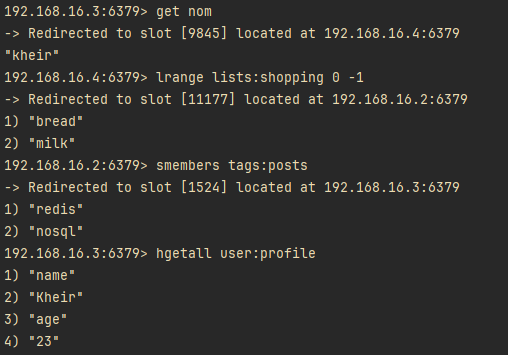
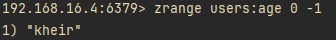

# Atelier Cluster Redis

## Partie 1 : Installation et Configuration du Cluster Redis

### 1.1 Installation de Redis via Docker Compose

#### 1.1.1 Installation de Docker

Pour installer Docker, il suffit de suivre les instructions sur le site officiel de Docker : https://docs.docker.com/get-docker/

On choisit l'environnement Docker étant donné que c'est le plus simple à installer vu qu'on l'a déjà utilisé dans les ateliers précédents.

#### 1.1.2 Installation de Docker Compose

On va créer un fichier `docker-compose.yml` pour installer Redis. Voici le contenu du fichier :

```yaml
version: '3'

services:
  redis-1:
    image: redis
    command: redis-server --cluster-enabled yes --cluster-config-file /data/nodes.conf --cluster-node-timeout 5000 --appendonly yes
    volumes:
      - redis-node1-data:/data
    ports:
      - "6379"

  redis-2:
    image: redis
    command: redis-server --cluster-enabled yes --cluster-config-file /data/nodes.conf --cluster-node-timeout 5000 --appendonly yes
    volumes:
      - redis-node2-data:/data
    ports:
      - "6380"

  redis-3:
    image: redis
    command: redis-server --cluster-enabled yes --cluster-config-file /data/nodes.conf --cluster-node-timeout 5000 --appendonly yes
    volumes:
      - redis-node3-data:/data
    ports:
      - "6381"

volumes:
  redis-node1-data:
  redis-node2-data:
  redis-node3-data:
```

Pour lancer les conteneurs Redis, on exécute la commande suivante:

```bash
docker-compose up
```

#### 1.1.3 Création du Cluster Redis

Avant de créer le cluster on va d'abord vérifier si les conteneurs Redis sont bien lancés:

```bash
docker ps
```

Ensuite, on va inspecter les conteneurs pour récupérer les adresses IP:

```bash
docker inspect -f '{{range .NetworkSettings.Networks}}{{.IPAddress}}{{end}}' <container_id>
```

Une fois qu'on a récupéré les adresses IP, on peut créer le cluster Redis:

```bash
docker exec -it <container_id> redis-cli --cluster create <ip1>:6379 <ip2>:6380 <ip3>:6381 --cluster-replicas 0
```

## Partie 2 : Premiers Pas avec le Cluster Redis

### 2.1 Injection de Données :

On va injecter des données dans le cluster Redis en utilisant la commande `redis-cli`:

```bash
docker exec -it <container_id> redis-cli -c -p 6379
```

le paramètre `-c` permet de se connecter à un cluster Redis tandis que le paramètre `-p` permet de spécifier le port.


Ensuite, on injecte les données suivantes:

pour les strings:

```bash
set nom "kheir"
```

pour les listes:

```bash
lpush lists:shopping "milk" "bread"
```

pour les sets:

```bash
sadd tags:post "redis" "cluster"
```

pour les hash:

```bash
hset user:profile name "Kheir" age 23
```

pour les sorted sets:

```bash
zadd users:age 23 "kheir"
```

### 2.2 Requêtage des Données :

On va requêter les données qu'on a injecté dans le cluster Redis:

```bash
get nom
```

```bash
lrange lists:shopping 0 -1
```

0 et -1 sont les indices de début et de fin de la liste.

```bash
smembers tags:posts
```

```bash
hgetall user:profile
```

```bash
zrange users:age 0 -1
```






## Partie 3: Intégration de Redis dans un Projet

### 3.1 Installation de Redis dans un Projet python

Pour installer Redis dans un projet python, on utilise le package `redis-py`:

```bash
pip install redis
```

### 3.2 Utilisation de Redis dans un Projet

